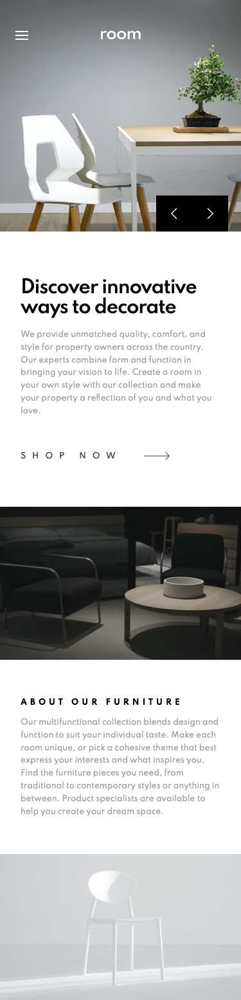
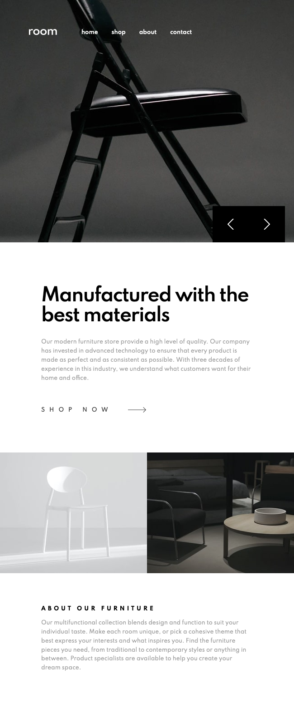
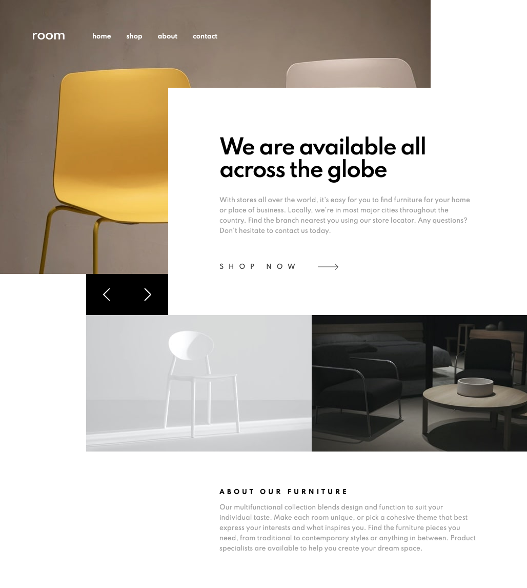
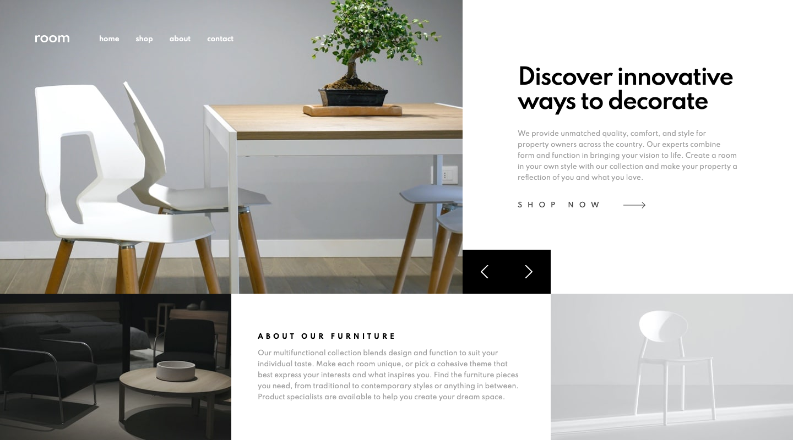

# Frontend Mentor - Room Homepage solution

This is a solution to the [Room Homepage challenge on Frontend Mentor](https://www.frontendmentor.io/challenges/room-homepage-BtdBY_ENq). Frontend Mentor challenges help you improve your coding skills by building realistic projects. 

### The challenge

Users should be able to:

- View the optimal layout for the site depending on their device's screen size
- See hover states for all interactive elements on the page
- Navigate the slider using either their mouse/trackpad or keyboard

## Screenshot

### Mobile


### Medium Viewport Size


### Large Viewport Size


### Extra Large Viewport Size


## Built with

- Semantic HTML5 markup
- CSS custom properties
- Flexbox
- CSS Grid
- Mobile-first workflow
- Vanilla JavaScript

## What I learned

There were many obstacles to overcome in this challenge and some of them were quite unexpected.

### The HTML
For example, I felt that my slides should be `<li>`s inside a `<ul>` element as this seemed to be the most semantically correct approach. The problem I encountered was that I could not place the slide buttons inside of the `<ul>` because they aren't part of the list. They had to sit outside the `<ul>` and this made it very difficult to position them correctly. I was forced into using absolute positioning and adjusting the property values at each media query to ensure they stay positioned nicely.

### The Navbar
The mobile layout has a hamburger menu which expands when you click the `<button>`. Four things happen when the hamburger menu is expanded:
1. The `.expanded` class is added to the `<nav>` element which controls the styles.
2. The `<body>` gets `position: fixed;` to prevent the user from being able to scroll vertically.
3. The `.blur` class is added to the `<main>` element which adds a nice blur effect behind the navbar.
4. The `aria-expanded` attribute becomes `true` to inform screen readers that the hamburger menu is expanded.
```js
NAVBAR_TOGGLE.addEventListener('click', function() {
    if (NAV.classList.contains('expanded')) {
        NAV.classList.remove('expanded');
        document.body.style.position = 'initial';
        MAIN.classList.remove('blur');
        NAVBAR_TOGGLE.setAttribute('aria-expanded', 'false');
    }
    else {
        NAV.classList.add('expanded');
        document.body.style.position = 'fixed';
        MAIN.classList.add('blur');
        NAVBAR_TOGGLE.setAttribute('aria-expanded', 'true');
    }
})
```
These four changes are reversed when the hamburger menu is closed.

The navbar proved to be a difficult component of the page, but I think this is because I discovered issues I had not noticed before, to do with focus and keyboard navigation.

When the menu is closed I didn't want the user to be able to tab to the links that aren't currently visible. I added this JavaScript code which basically says "when the navbar is closed, if the first link receives focus, change the focus to the first slider button; or if the last link receives focus, change the focus to the hamburger button". This will only happen when the navbar is closed since it checks to see if the element doesn't have a `transform` value:
```js
/* Skip 'focus' on nav-links while they are hidden from view */
NAV_LINKS[0].addEventListener('focus', () => {
    if (window.getComputedStyle(NAVBAR).transform !== 'none') SLIDE_BTNS[0].focus();
})
NAV_LINKS[NAV_LINKS.length - 1].addEventListener('focus', () => {
    if (window.getComputedStyle(NAVBAR).transform !== 'none') NAVBAR_TOGGLE.focus();
})
```

While the hamburger menu was expanded, it was possible for the user to tab to the slider buttons and interact with the carousel. To prevent this I added code which closes the hamburger menu if the first slider button receives focus. I also decided to make the hamburger menu close if the user clicks outside of the menu (i.e. the `<main>` element), again so that they cannot interact with the carousel while the hamburger menu is open. The hamburger menu also closes if the users resizes the window.

### The Carousel
This was only my second time creating a carousel and it turned out much better than the first. The text is also transformed as well as the image. Here is the CSS for the slide element.

```css
.slide {
    grid-area: 1 / 1 / 2 / 2; /* To make slides overlap */
    display: grid;
    visibility: hidden;
    opacity: 0;
    transition: opacity var(--anim-duration),
                visibility var(--anim-duration);
}

.slide.active {
    visibility: initial;
    opacity: 1;
}
```

You will see that the element is positioned in a grid of 1 row by 1 column. I have never seen CSS Grid used like this before but I thought it was a clever way of getting the slides to stack on top of each other without having to use absolute positioning. The `opacity` is `0` but animates to `1` when the slide becomes 'active'. `visibility` might seem redundant here. The reason I included it is so that when the slide does become visible, the screen reader will read out the content, triggered by the `aria-live="polite"` attribute on the `<ul>` element. `visibility` cannot be animated properly, though by adding it to `transition` it removed the white flashing that was occurring every time the slide changed.

A problem I had regarding keyboard navigation, was the user could tab to the 'shop now' link for slides that weren't 'active'. Using JavaScript I had to add `tab-index="-1"` to each link and then remove it for the one which became active.

## Continued development

This was a fantastic project and I learned so much, particularly about accessibility, keyboard navigation and focus order. I am going to continue doing intermediate projects on Frontend Mentor as these are really testing my skills and knowledge.

## Useful resources

- [How To Create An Animated Image Carousel With CSS/JavaScript](https://www.youtube.com/watch?v=9HcxHDS2w1s) - This was a helpful guide for creating a carousel, however I didn't understand all the JavaScript and managed to simplify the code into something I could understand.
